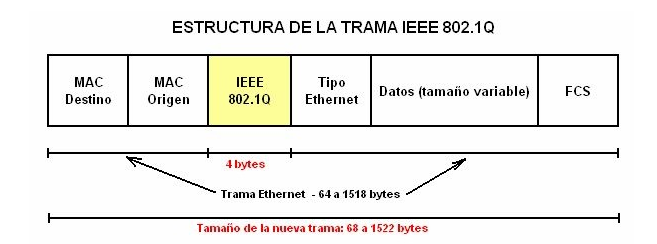

# Unidad 1 — Conceptos y Arquitectura VLAN

## Resumen de Estudio | Administración de Redes

---

## 1. Conceptos Previos Fundamentales

### ¿Qué es un Switch?

Un **switch** (conmutador) es un dispositivo de red que opera en la **capa 2 (enlace de datos)** del modelo OSI. Su función principal es **interconectar dispositivos dentro de una misma red local (LAN)** y reenviar tramas Ethernet basándose en las **direcciones MAC** de los dispositivos conectados.

A diferencia de un hub (que reenvía todo el tráfico por todos sus puertos), el switch **aprende qué dispositivo está conectado a cada puerto** mediante su tabla de direcciones MAC (tabla CAM). Esto le permite enviar las tramas únicamente al puerto donde se encuentra el destinatario, mejorando la eficiencia y reduciendo las colisiones.

**Características clave del switch:**

- Opera en capa 2 (direcciones MAC).
- Mantiene una tabla CAM (Content Addressable Memory) que asocia MAC ↔ puerto.
- Cada puerto forma un **dominio de colisión** independiente.
- Por defecto, todos los puertos de un switch pertenecen al **mismo dominio de broadcast** (difusión).

---

### ¿Qué es un Dominio de Difusión (Broadcast Domain)?

Un **dominio de broadcast** es el conjunto de todos los dispositivos que reciben una trama de difusión (broadcast) enviada por cualquiera de ellos. 

Cuando un dispositivo envía una trama con dirección MAC destino `FF:FF:FF:FF:FF:FF`, esta llega a **todos los dispositivos dentro del mismo dominio de broadcast**.

En un switch sin VLANs configuradas, **todos los puertos forman un único dominio de broadcast**. 

Esto significa que un broadcast enviado desde cualquier puerto inunda todos los demás puertos del switch. 
En redes grandes, esto genera tráfico innecesario y problemas de rendimiento.

**Problema:** A medida que una red crece, el tráfico broadcast se incrementa, consumiendo ancho de banda y reduciendo el rendimiento general. 

Aquí es donde entran las VLANs como solución.

---

## 2. Definición de VLAN

**VLAN** = **Virtual Local Area Network** (Red de Área Local Virtual).

Una VLAN crea un **dominio de difusión independiente a nivel 2** dentro de un mismo switch físico. 

Permite **separar lógicamente una red sin necesidad de cambiar el cableado físico**.

### ¿Cómo funciona?

El administrador asigna puertos específicos del switch a VLANs específicas. 
Los dispositivos conectados a puertos de la misma VLAN pueden comunicarse entre sí, pero **no pueden comunicarse directamente** con dispositivos de otra VLAN (están en dominios de broadcast distintos).

**Ejemplo práctico:** Imaginemos un switch con 24 puertos en una empresa con tres departamentos:

- **Puertos 1-8** → VLAN 10 (Ingeniería)
- **Puertos 9-16** → VLAN 20 (RRHH)
- **Puertos 17-24** → VLAN 30 (Logística)

Si un equipo de Ingeniería envía un broadcast, solo lo reciben los equipos de los puertos 1-8. RRHH y Logística **no lo escuchan**. Es como tener tres switches separados, pero con un solo dispositivo físico.

### Detalle técnico

Las VLANs creadas se almacenan en la **base de datos del switch** en un archivo llamado **`vlan.dat`**. 

Este archivo persiste incluso si se borra la configuración de arranque (startup-config), lo cual es un detalle importante a tener en cuenta en la administración.

---

## 3. Beneficios de las VLANs

Las VLANs ofrecen ventajas significativas para el diseño y la administración de redes:

- **Separación de departamentos:** Cada departamento puede tener su propia VLAN, aislando su tráfico del resto.
- **Reducción del tráfico broadcast:** Al dividir la red en VLANs más pequeñas, el tráfico de difusión se limita a cada VLAN, mejorando el rendimiento.
- **Mejora del rendimiento de la red:** Menos tráfico innecesario significa más ancho de banda disponible para el tráfico legítimo.
- **Mayor seguridad a nivel de enlace:** Los dispositivos de una VLAN no pueden acceder directamente a los de otra, lo que añade una capa de aislamiento.

### Asignación de VLANs

- Las VLANs se asignan directamente a los **puertos del switch**.
- El equipo conectado a un puerto **hereda la VLAN** de ese puerto.
- La información de VLANs se almacena en el archivo **vlan.dat**.

---

## 4. El Problema Multi-Switch

En redes reales, las empresas utilizan **múltiples switches**. 

Un mismo departamento puede tener empleados conectados a switches distintos (en edificios o plantas diferentes). 

Surge la necesidad de **extender la VLAN entre switches**.

### La solución incorrecta: Un cable por VLAN

La idea de tender un cable físico dedicado por cada VLAN entre cada par de switches **no es viable** por varias razones:

- **Coste:** Demasiado caro en cables e infraestructura.
- **Escalabilidad:** Con 50 VLANs y 50 switches, la gestión se vuelve imposible.
- **Capacidad:** Se agotarían los puertos del switch solo para interconexiones, sin dejar puertos para los usuarios.

### La solución correcta: Puertos TRUNK

---

## 5. Puertos Trunk

Un **puerto Trunk** es un puerto del switch configurado para **transportar tráfico de múltiples VLANs simultáneamente** por un solo enlace físico.

### Características principales

- Por defecto, un puerto trunk pertenece a **todas las VLANs**.
- Evita la necesidad de usar un puerto (y un cable) por cada VLAN entre switches.
- Permite **extender las VLANs a toda la red** usando un solo enlace físico entre cada par de switches.

### ¿Cómo funciona? — Etiquetado 802.1Q

Cuando una trama viaja por un enlace trunk, 
el switch de origen añade una **etiqueta (tag)** a la trama Ethernet siguiendo el estándar **IEEE 802.1Q**. 
Esta etiqueta contiene el **identificador de la VLAN (VLAN ID)** a la que pertenece la trama.

El proceso es el siguiente:

1. Un PC en la VLAN 10 envía una trama al switch.
2. El switch, al enviar la trama por el puerto trunk, le añade la etiqueta 802.1Q con VLAN ID = 10.
3. La trama viaja por el cable trunk con su etiqueta.
4. El switch receptor lee la etiqueta, identifica que la trama pertenece a la VLAN 10 y la reenvía solo por los puertos asignados a la VLAN 10.
5. Antes de entregar la trama al dispositivo final, **el switch elimina la etiqueta** (el PC nunca la ve).

**Resultado:** El tráfico de todas las VLANs viaja junto por el mismo cable, pero está **lógicamente separado** gracias al etiquetado.

---

## 6. Comunicación entre VLANs

### ¿Se pueden comunicar las VLANs entre sí?

**Por defecto, NO.** Cada VLAN es un dominio de broadcast independiente. Los dispositivos de la VLAN 10 no pueden hablar con los de la VLAN 20 sin intervención adicional.

### Lo que NO se debe hacer

Conectar puertos de distintas VLANs directamente entre sí (con un cable cruzado o a través de un hub) es un **error grave**. Al hacerlo:

- Se **fusionan los dominios de difusión** de ambas VLANs.
- Se produce **inundación (flooding)**.
- Se deshace toda la segmentación que se había configurado.

### La solución: El Router (Nivel 3)

Para comunicar VLANs distintas de forma controlada, se necesita un dispositivo de **Nivel 3 (capa de red)** del modelo OSI: un **router** o un **switch de capa 3**.

**Conceptos clave:**

- Para comunicar dominios de difusión distintos (VLANs), se necesita un dispositivo que trabaje con **direcciones IP** (Nivel 3).
- Cada VLAN debe corresponder a una **subred IP distinta** (por ejemplo: VLAN 10 → 192.168.10.0/24, VLAN 20 → 192.168.20.0/24).
- El router actúa como **pasarela (gateway) controlada** entre las VLANs, decidiendo qué tráfico puede pasar de una a otra.

---

## 7. Resumen: Los Tres Pilares de la Arquitectura de Red

| Pilar | Función | Nivel OSI |
|---|---|---|
| **Segmentar (VLANs)** | Seguridad y control de broadcast | Nivel 2 (Enlace) |
| **Extender (Trunk)** | Conexión eficiente entre múltiples switches | Nivel 2 (Enlace) |
| **Enrutar (Router)** | Comunicación entre VLANs mediante IP | Nivel 3 (Red) |

Estos tres conceptos son los **pilares fundamentales** para diseñar, administrar y mantener cualquier red de datos moderna.

---

*Asignatura: Administración de Redes — Ingeniería Informática (UAX)*

### Matiz importante: comunicar equipos no es lo mismo que comunicar VLANs

En ejercicios de arquitectura de nivel 2 hay que distinguir entre dos ideas parecidas, pero no iguales:

- Que dos equipos de VLANs diferentes puedan intercambiar datos.
- Que dos VLANs estén comunicadas correctamente manteniendo separados sus dominios de difusión.

Dos equipos de VLANs distintas podrían llegar a intercambiar tramas a nivel 2 si se unen físicamente de forma incorrecta, por ejemplo:

- mediante un cable cruzado entre puertos de distintas VLANs;
- mediante un hub que conecte equipos o puertos pertenecientes a VLANs diferentes.

Pero esto no significa que las VLANs estén bien comunicadas. En realidad, se está rompiendo la segmentación, porque se mezclan dominios de difusión que deberían permanecer separados.

Por tanto:

- **Cable cruzado entre VLANs diferentes** → puede permitir comunicación, pero es una mala práctica.
- **Hub entre VLANs diferentes** → puede permitir comunicación, pero también rompe el aislamiento.
- **Router o switch de capa 3** → es la forma correcta de comunicar VLANs distintas, porque permite el paso entre redes manteniendo separados los dominios de broadcast de nivel 2.

En una comunicación mediante router, no basta con que el router esté físicamente conectado. La comunicación dependerá también de la configuración IP: las subredes de cada VLAN, las direcciones IP de las máquinas, las interfaces del router y las puertas de enlace configuradas.

